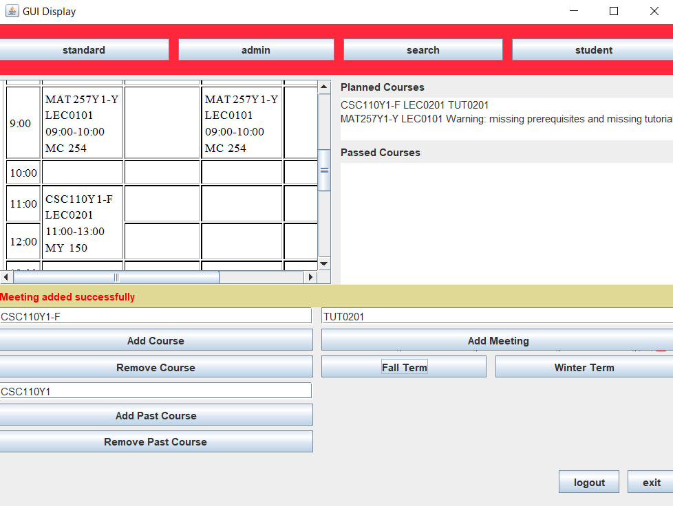

# UofT Timetable Manager

This is a Java app that allows users to plan for courses whilst catching as many issues as possible,
so they don't enroll in a course they can't take by mistake.

## Dependencies

This project uses **Java 18.**
I'm unsure if it is backwards compatible.
If you seem to be getting errors, ensure that your JDK is Java 18.

Maven manages these dependencies, so you don't need to worry about installing external packages.

## Running the project

Please read the section below before running this for the first time.

- Run `MainLoop` in `src/main/java/org/` for the command-line version of this program.

- Run `RunGUIDisplay` in the same path above for the GUI version of this program.

## Important information regarding running this program for the  first time

After running your program once, you must stop the program and edit your run
configurations such that the
working directory is set
to `$MODULE_WORKING_DIR$`.
Then, you may subsequently run the program like normal.
Otherwise, exceptions regarding files
not being found may arise.
Moreover, the program won't be able to properly load courses if you don't.

## Additional information

Much of the user input is similar to Phase 1, although there have been a few changes.

Most of the work in Phase 2 was implementing the GUI and implementing design patterns and cleaning up code.

## Screenshots

